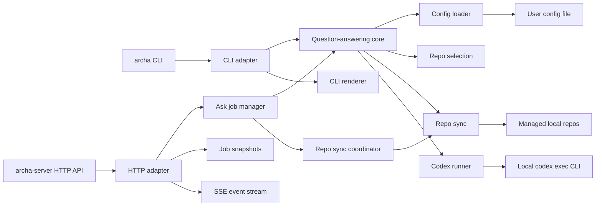
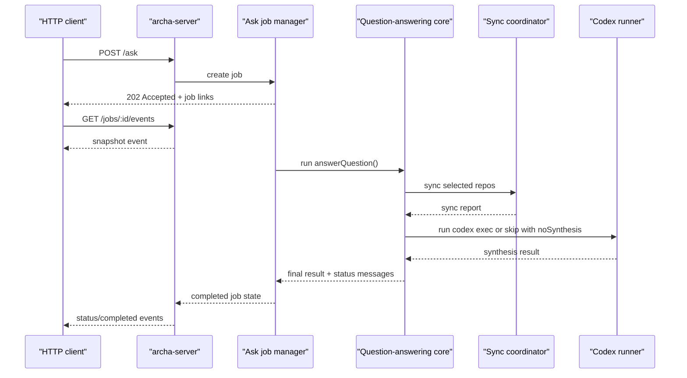

# Architecture

Archa answers questions about how your code behaves by resolving the in-scope repos, syncing them locally, and running Codex against the right workspace. The same core flow is shared by the CLI and the optional HTTP server.

## Component map

## High-level flow

1. A transport adapter receives a request, including the question plus optional audience and execution overrides.
2. Commands that require Git check that the local `git` CLI is installed before continuing.
3. Discovery commands check that GitHub access is available via `GH_TOKEN` / `GITHUB_TOKEN` or, if those env vars are unset, via a usable `gh` login before continuing.
4. Commands that require Codex check that the local `codex` CLI is installed and `codex login status` reports a logged-in session before continuing.
5. Config is loaded from the user config path.
6. Repo selection chooses explicit repos or heuristic candidates, keeps any pinned repos in scope, and falls back to all configured repos when nothing scores positively.
7. Repo sync clones missing selected repos, unshallows any shallow managed checkout, and then fast-forwards it to the latest tracked trunk tip.
8. Codex runs against either the single selected repo or the managed repos root.
9. The adapter renders the result:
   - CLI: text to stdout plus status to stderr
   - HTTP: async job state plus SSE status events, with the web UI optionally loading the configured repo catalog for picker-style selection

## HTTP ask flow

## Sync coordination

Within one `archa-server` process, concurrent jobs share repo sync work by repo directory. If one job is already cloning or updating a repo, later jobs wait for that same in-flight sync result instead of starting a second clone or pull. This coordination is in-memory only, so it applies inside a single server process, not across multiple processes.

## Main modules

- `src/cli.js`
  Dispatches commands, resolves question files, prints output, and handles interactive CLI bootstrap when config is missing or freshly initialized without repos.
- `src/server-main.js`
  Parses server startup arguments, reuses the same interactive config bootstrap flow as `archa`, and then boots the HTTP adapter.
- `src/cli-bootstrap.js`
  Hosts the shared interactive CLI prompts and bootstrap flow for missing-config initialization and optional GitHub discovery continuation, including the Enter-to-use-`@accessible` owner shortcut.
- `src/config-paths.js`
  Resolves the active config path and default managed repos root.
- `src/config.js`
  Loads and validates config, bootstraps a config file from scratch or from an imported catalog, and applies selected GitHub discovery additions or overrides into the active config.
- `src/github-catalog.js`
  Discovers repos from a GitHub user or org, or from the special `@accessible` scope that spans the authenticated user's personal and organization-visible repos, using authenticated GitHub access from `GH_TOKEN` / `GITHUB_TOKEN` or, if those env vars are unset, the current `gh` login so private repos and higher rate limits can be used, normalizes them into repo definitions, preserves source-owner metadata for multi-owner discovery displays, supports a names-first selection pass for `--apply` without per-repo topic fetches, and then refines only the selected subset with one-repo-at-a-time repo-content inspection plus a Codex cleanup pass before comparing the result with the current config to classify additions, conflicts, and metadata review suggestions.
- During selected-repo `--apply` curation, the CLI/server adapters persist each curated repo into config as soon as its refined metadata is ready, instead of batching the entire subset until the end.
- `src/github-discovery-auth.js`
  Checks whether GitHub discovery can authenticate via `GH_TOKEN` / `GITHUB_TOKEN` or, as a fallback, via a usable `gh` CLI session, and formats user-facing setup guidance when neither path is available.
- `src/github-discovery-progress.js`
  Formats stderr progress updates for GitHub discovery so CLI and server bootstrap flows do not look stuck while repo names are being listed or selected repos are being curated.
- `src/github-discovery-selection.js`
  Resolves explicit or interactive discovery selections so GitHub imports can add only chosen repos and override only chosen configured repos, using a combined interactive list of new and already configured repos with an Enter-to-add-all-new confirmation path and owner-grouped multi-owner displays that only fall back to owner-qualified repo labels when names collide.
- `src/repo-classification-inspector.js`
  Reuses an existing managed checkout when available, otherwise shallow-clones a selected repo temporarily, then inspects repo structure, manifests, dependencies, and README cues to infer fallback descriptions, fallback topics, and high-signal classifications such as `external`, `internal`, `infra`, `frontend`, `backend`, and `cli`, keeping `external` limited to clearly outward-facing surfaces rather than generic API mentions.
- `src/repo-metadata-codex-curator.js`
  Runs a Codex cleanup pass in the inspected repo checkout to refine the heuristic discovery draft into the final description, topics, and classifications written during selected-repo discovery apply flows.
- `src/question-answering.js`
  Implements the transport-agnostic ask flow and accepts injectable adapters such as status reporters and sync functions.
- `src/repo-selection.js`
  Resolves explicit repo names and aliases, or scores likely repos from repo-name tokens, descriptions, topics, and separately weighted classifications while keeping repos marked `alwaysSelect` in scope and falling back to all configured repos when nothing scores positively.
- `src/repo-sync.js`
  Clones missing repos and fast-forwards existing repos to the latest remote `main` or `master` tip, first unshallowing any shallow managed checkout.
- `src/git-installation.js`
  Checks whether the local `git` CLI is installed and formats user-facing installation guidance when it is missing.
- `src/repo-sync-coordinator.js`
  Deduplicates concurrent syncs for the same repo within a single server process.
- `src/codex-runner.js`
  Wraps `codex exec`, manages the audience-aware prompt, heartbeats, execution timeout, and final-message capture.
- `src/codex-installation.js`
  Checks whether the local `codex` CLI is installed and logged in, and formats user-facing installation/login guidance when it is not ready.
- `src/ask-job-manager.js`
  Maintains in-memory async jobs, per-job event history, and bounded execution concurrency.
- `src/http-server.js`
  Exposes the HTTP API, request validation, repo catalog responses, polling responses, and SSE streams.
- `src/ui.html.js`
  Self-contained HTML, CSS, and JavaScript for the browser-based question UI, including the config-backed repo picker, exported as a string constant.
- `src/render.js`
  Converts results into simple CLI output.
- `src/status-reporter.js`
  Adapts status messages to stderr or other consumers such as job event streams.

## Configuration model

The installed config file owns:

- the root directory used for managed clones
- the list of managed repos

Repo definitions include:

- `name`
- `url`
- `defaultBranch`
- `description`
- `topics`
- `classifications`
  Additive high-signal roles such as `library`, `infra`, `internal`, or `external`; multiple values may coexist when supported by the metadata and inspected repo structure.
- optional `aliases`
- optional `alwaysSelect`

Repo names and aliases are validated eagerly and must be unique case-insensitively.

## HTTP runtime model

- jobs are kept in memory only
- completed jobs expire after a retention window
- server concurrency is bounded to avoid spawning unbounded Codex processes
- server shutdown cancels queued jobs, drains running jobs, and clears manager state after the drain completes
- repo sync coordination is per-process and keyed by repo directory
- SSE clients receive a snapshot first, then live events until the job reaches a terminal state

## Testing model

- Vitest is used for unit tests.
- Coverage is enforced on statements and branches.
- The highest-value tests cover:
  - argument parsing
  - config loading and initialization
  - repo selection
  - Codex runner behavior and error handling
  - sync coordination
  - async job lifecycle
  - HTTP request handling and SSE behavior
