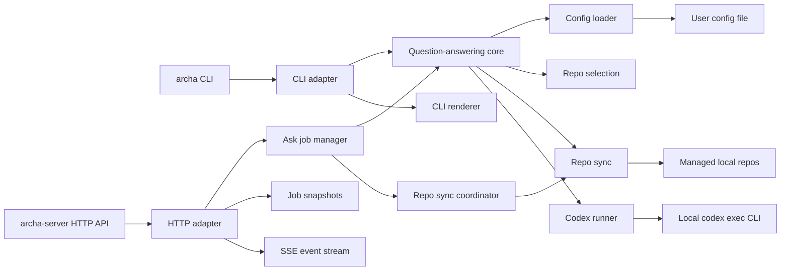
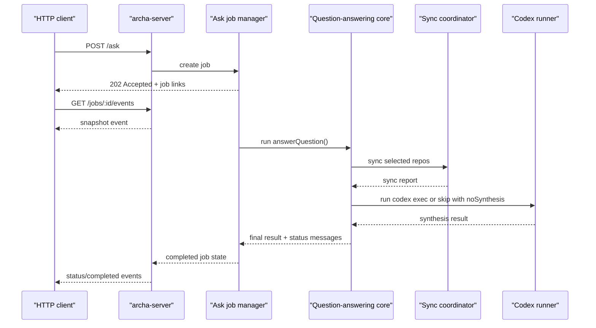

# Architecture

Archa answers questions about how your code behaves by selecting relevant repos, syncing them locally, and running Codex against the right workspace. The same core flow is shared by the CLI and the optional HTTP server.

## Component map

## High-level flow

1. A transport adapter receives a request.
2. Config is loaded from the user config path.
3. Repo selection chooses explicit repos or heuristic candidates.
4. Repo sync clones or fast-forwards the selected repos.
5. Codex runs against either the single selected repo or the managed repos root.
6. The adapter renders the result:
   - CLI: text to stdout plus status to stderr
   - HTTP: async job state plus SSE status events

## HTTP ask flow

## Sync coordination

Within one `archa-server` process, concurrent jobs share repo sync work by repo directory. If one job is already cloning or updating a repo, later jobs wait for that same in-flight sync result instead of starting a second clone or pull. This coordination is in-memory only, so it applies inside a single server process, not across multiple processes.

## Main modules

- `src/cli.js`
  Dispatches commands, resolves question files, and prints output.
- `src/server-main.js`
  Parses server startup arguments and boots the HTTP adapter.
- `src/config-paths.js`
  Resolves the active config path and default managed repos root.
- `src/config.js`
  Loads and validates config, and bootstraps a config file from scratch or from an imported catalog.
- `src/question-answering.js`
  Implements the transport-agnostic ask flow and accepts injectable adapters such as status reporters and sync functions.
- `src/repo-selection.js`
  Performs lightweight token-based repo scoring and alias matching, then falls back to the first configured repo.
- `src/repo-sync.js`
  Clones missing repos and fast-forwards existing repos to `main` or `master`.
- `src/repo-sync-coordinator.js`
  Deduplicates concurrent syncs for the same repo within a single server process.
- `src/codex-runner.js`
  Wraps `codex exec`, manages the prompt, heartbeats, execution timeout, and final-message capture.
- `src/ask-job-manager.js`
  Maintains in-memory async jobs, per-job event history, and bounded execution concurrency.
- `src/http-server.js`
  Exposes the HTTP API, request validation, polling responses, and SSE streams.
- `src/render.js`
  Converts results into simple CLI output.
- `src/status-reporter.js`
  Adapts status messages to stderr or other consumers such as job event streams.

## Configuration model

The installed config file owns:

- the root directory used for managed clones
- the list of managed repos

Repo definitions include:

- `name`
- `url`
- `defaultBranch`
- `description`
- `topics`
- optional `aliases`

## HTTP runtime model

- jobs are kept in memory only
- completed jobs expire after a retention window
- server concurrency is bounded to avoid spawning unbounded Codex processes
- repo sync coordination is per-process and keyed by repo directory
- SSE clients receive a snapshot first, then live events until the job reaches a terminal state

## Testing model

- Vitest is used for unit tests.
- Coverage is enforced on statements and branches.
- The highest-value tests cover:
  - argument parsing
  - config loading and initialization
  - repo selection
  - Codex runner behavior and error handling
  - sync coordination
  - async job lifecycle
  - HTTP request handling and SSE behavior
